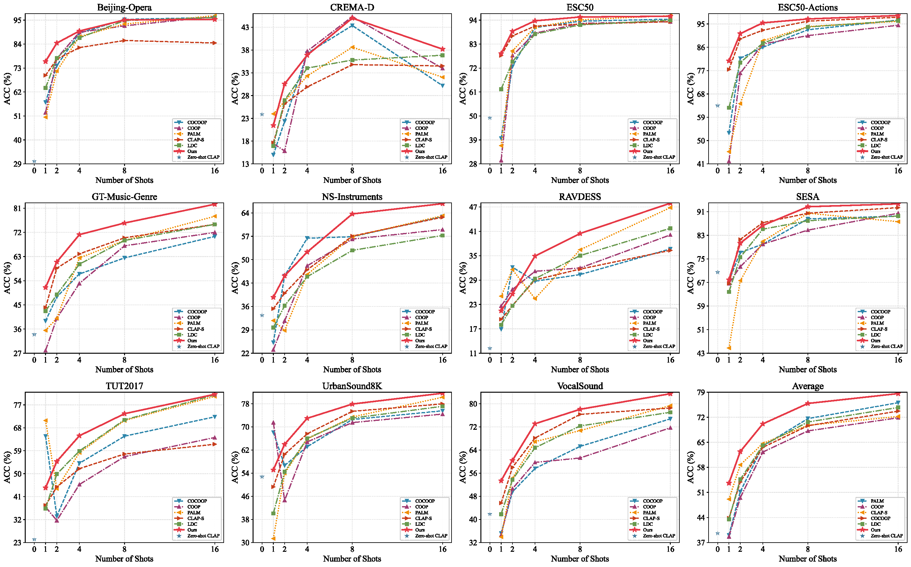

# Learning Dual-Modal Prototypes for CLAP-based Few-Shot Audio Classification


## Table of Contents
- [Learning Dual-Modal Prototypes for CLAP-based Few-Shot Audio Classification](#learning-dual-modal-prototypes-for-clap-based-few-shot-audio-classification)
  - [Table of Contents](#table-of-contents)
  - [Installation :gear:](#installation-gear)
  - [Model :white\_square\_button:](#model-white_square_button)
  - [Datasets :page\_with\_curl:](#datasets-page_with_curl)
  - [Code Structure :snowflake:](#code-structure-snowflake)
  - [Run Experiments :zap:](#run-experiments-zap)
  - [Acknowledgement :pray:](#acknowledgement-pray)

</br>
</br>

<a name="installation"/>

## Installation :gear:
1. Create a conda environment
```shell
conda create --name DMPT python=3.8
conda activate DMPT
```
2. Install PyTorch and other dependencies
```shell
git clone https://github.com/YvoGao/DMPT
cd DMPT
pip install -r requirements.txt
```

</br>
<a name="model"/>
    
## Model :white_square_button:
We have shown the efficacy of DMPT and other baselines (ZERO-SHOT, COOP, COCOOP, PALM) using [PENGI](https://github.com/microsoft/Pengi) model. 

Download the pre-trained PENGI model using the link provided below and place the checkpoint file at path [`pengi/configs`](/pengi/configs) (after clonning the repo). 


| Model | Link | Size |
|:-- |:-- | :-- |
| PENGI | [Download](https://zenodo.org/records/8387083/files/base.pth) | 2.2 GB | 

<br>

PENGI checkpoint can also be downloaded with following command:
```bash
wget https://zenodo.org/records/8387083/files/base.pth
```

</br>

<a name="datasets"/>
    
## Datasets :page_with_curl:

We have performed experiments on 11 audio classification datasets.  Instructions for downloading/processing datasets used by our method have been provided in the [DATASETS.md](DATASETS.md). 

| Dataset | Type | Classes | Size | Link |
|:-- |:-- |:--: |--: |:-- |
| [Beijing-Opera](https://compmusic.upf.edu/bo-perc-dataset) | Instrument Classification | 4 | 69 MB | [Instructions](DATASETS.md#beijing-opera) |
| [CREMA-D](https://github.com/CheyneyComputerScience/CREMA-D) | Emotion Recognition | 6 | 606 MB | [Instructions](DATASETS.md#crema-d) |
| [ESC50](https://github.com/karolpiczak/ESC-50) | Sound Event Classification | 50 | 881 MB | [Instructions](DATASETS.md#esc50) |
| [ESC50-Actions](https://github.com/karolpiczak/ESC-50) | Sound Event Classification | 10 | 881 MB | [Instructions](DATASETS.md#esc50-actions) |
| [GT-Music-Genre](https://www.kaggle.com/datasets/andradaolteanu/gtzan-dataset-music-genre-classification) | Music Analysis | 10 | 1.3 GB | [Instructions](DATASETS.md#gt-music-genre) |
| [NS-Instruments](https://magenta.tensorflow.org/datasets/nsynth) | Instrument Classification | 10 | 18.5 GB | [Instructions](DATASETS.md#ns-instruments) |
| [RAVDESS](https://zenodo.org/records/1188976#.YFZuJ0j7SL8) | Emotion Recognition | 8 | 1.1 GB | [Instructions](DATASETS.md#ravdess) |
| [SESA](https://zenodo.org/records/3519845) | Surveillance Sound Classification | 4 | 70 MB | [Instructions](DATASETS.md#sesa) |
| [TUT2017](https://zenodo.org/records/400515) | Acoustic Scene Classification | 15 | 12.3 GB | [Instructions](DATASETS.md#tut2017) |
| [UrbanSound8K](https://urbansounddataset.weebly.com/urbansound8k.html) | Sound Event Classification | 10 | 6.8 GB | [Instructions](DATASETS.md#urbansound8k) |
| [VocalSound](https://github.com/YuanGongND/vocalsound) | Vocal Sound Classification | 6 | 8.2 GB | [Instructions](DATASETS.md#vocalsound) |

</br>
</br>

All datasets should be placed in a directory named `Audio-Datasets` and the path of this directory should be specified in the variable `DATASET_ROOT` in the shell [`scripts`](/scripts/). The directory structure should be as follows:
```
Audio-Datasets/
    ├── Beijing-Opera/
    ├── CREMA-D/
    ├── ESC50/ 
    ├── ESC50-Actions/
    ├── GT-Music-Genre/
    ├── NS-Instruments/
    ├── RAVDESS/
    ├── SESA/
    ├── TUT2017/
    ├── UrbanSound8K/
    ├── VocalSound/
 ```


</br>

<a name="code-structure"/>

## Code Structure :snowflake:
There are three main folders in this repo: `pengi`, `palm`, `utils`. Code in [`pengi`](/pengi) folder is taken from [PENGI](https://github.com/microsoft/Pengi) repo for model instantiation. Implementation of baselines (`zeroshot`, `coop`, `cocoop`) and our method `palm` is in [`palm`](/palm) folder. Class definitions of audio and text encoder of PENGI model can be found in [`palm/encoders.py`](/palm/encoders.py) file. Training and dataset related code is in [`utils`](/utils) folder.

</br>

<a name="run-experiments"/>

## Run Experiments :zap:

We have performed all experiments on `NVIDIA A100-SXM4-40GB` GPU. Shell scripts to run experiments can be found in [`scripts`](/scripts/) folder. 

```shell
## General Command Structure
bash  <SHELL_SCRIPT>  <METHOD_NAME>
```

Following methods (including `DMPT`) are supported in this repository:

`zeroshot` `coop` `cocoop` `palm` `DMPT`

Examples to run `palm` method on different audio classifiction datasets have been provided below:

```shell
bash scripts/beijing_opera.sh DMPT 
bash scripts/crema_d.sh DMPT
bash scripts/esc50_actions.sh DMPT
bash scripts/esc50.sh DMPT
bash scripts/gt_music_genre.sh DMPT
bash scripts/ns_instruments.sh DMPT
bash scripts/ravdess.sh DMPT
bash scripts/sesa.sh DMPT
bash scripts/tut.sh DMPT
bash scripts/urban_sound.sh DMPT
bash scripts/vocal_sound.sh DMPT
```

Results are saved in `json` format in [`logs`](/logs) directory. To process results (take an average across all folds/seeds and print), run the following command (after running all experiments):

```bash
cd logs
bash results.sh
```

<details>
<summary>Sample Output</summary>



</details>

**Note** For multi-fold datasets, we run experiments using cross-validation and then report average results on each seed. 

</br>

<a name="results"/>


## Acknowledgement :pray:
We used [PENGI](https://github.com/microsoft/Pengi) for model instantiation and borrowed a part of code from [COOP/COCOOP](https://github.com/KaiyangZhou/CoOp) [PALM](https://github.com/asif-hanif/DMPT) to implement baselines. We thank the respective authors for releasing the code.

<hr />

